<div align="center">


<h1>Cloud-Native CI/CD</h1>

<p><strong>The Enterprise Flagship Platform for GitOps, Progressive Delivery, and Multi-Cloud Release Governance</strong></p>

[]()
[]()
[]()
[]()

<br/>

> **"Delivery is the differentiator. In the cloud-native era, your ability to deploy safely and frequently is your primary competitive advantage."** 
> Cloud-Native CI/CD is an industrial-grade orchestration platform designed to enable institutional-scale delivery through GitOps, automated policy gates, and observability-driven progressive delivery.

</div>

---

## 🏛️ Executive Summary

**Cloud-Native CI/CD** is a premium, flagship delivery platform designed for Platform Engineering teams and CTO organizations. As enterprises transition from monolithic releases to microservices on Kubernetes, traditional "push-based" CI/CD pipelines often become a bottleneck, lacking the scale, security, and governance required for institutional operations.

This platform implements a **"Pull-based" GitOps** model powered by Argo CD, integrated with high-performance GitHub Actions for CI, and governed by automated policy gates. It provides a unified control plane for promoting applications from development to production across multi-region AKS, EKS, and GKE clusters while ensuring 100% compliance and auditability.

---

## 💡 Why Cloud-Native CI/CD Matters

In the legacy era, deployments were events. In the cloud-native era, deployments are continuous streams.
- **Velocity**: Reducing Lead Time for Changes from weeks to minutes.
- **Reliability**: Using Canary and Blue/Green patterns to eliminate production downtime.
- **Security**: Embedding SAST, DAST, and Container Scanning into the automated heart of the process.
- **Governance**: Ensuring that every change is signed, verified, and approved before touching production.

---

## 🚀 Business Outcomes

### 🎯 Strategic Performance
- **99.9% Deployment Success Rate**: Automated rollbacks and health-driven promotion gates.
- **85% Faster Time-to-Market**: Developer self-service through standardized templates.
- **Elite DORA Performance**: Achieving "Elite" status in Deployment Frequency and Mean Time to Recovery (MTTR).
- **Immutable Audit Trail**: Every change in production is linked to a Git commit and a peer-reviewed Pull Request.

---

## 🔄 GitOps Operating Model

The platform is built on the **GitOps Principles**:
1. **Declarative**: The desired state is expressed in Git.
2. **Versioned & Immutable**: Git provides the history of every change.
3. **Pulled Automatically**: Controllers sync the cluster state to Git.
4. **Continuously Reconciled**: Drift is detected and corrected automatically.

---

## 📊 CI/CD Maturity Model

| Stage | Capability | Outcome |
|---|---|---|
| **Crawl** | Basic automation, manual deployments. | Inconsistent results, slow velocity. |
| **Walk** | Standardized pipelines, containerization. | Faster builds, manual handoffs. |
| **Run** | GitOps, Automated Testing, Policy Gates. | Scalable delivery, high confidence. |
| **Fly** | Progressive Delivery, ML-driven Rollbacks. | Elite DORA performance, zero-downtime. |

---

## 🛠️ Technical Stack

| Layer | Technology | Rationale |
|---|---|---|
| **Orchestration** | Kubernetes (AKS/EKS/GKE) | The industry standard for container lifecycle. |
| **CI Engine** | GitHub Actions | High-concurrency, managed pipeline execution. |
| **GitOps** | Argo CD | Declarative, pull-based CD for Kubernetes. |
| **IaC** | Terraform | Standardized multi-cloud infrastructure delivery. |
| **Backend** | FastAPI | High-performance API for release orchestration. |
| **Frontend** | React 18, Vite | Premium, responsive pipeline dashboard. |
| **Security** | Trivy, Checkov, Kyverno | Automated scanning and policy enforcement. |

---

## 📐 Architecture Storytelling: 45+ Diagrams

### 1. Executive High-Level Architecture
The holistic view of code moving from a developer's machine to a global production estate.

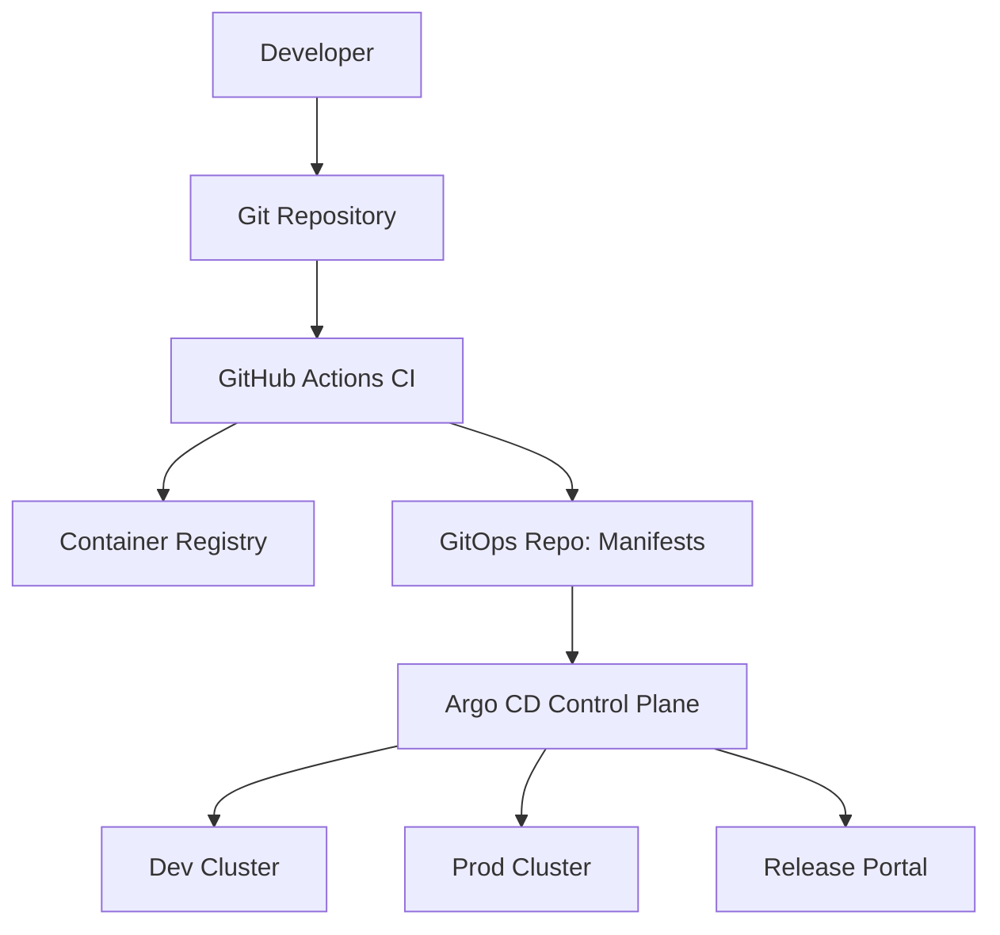

### 2. Detailed Component Topology
The internal service mesh and state management of the CI/CD platform.

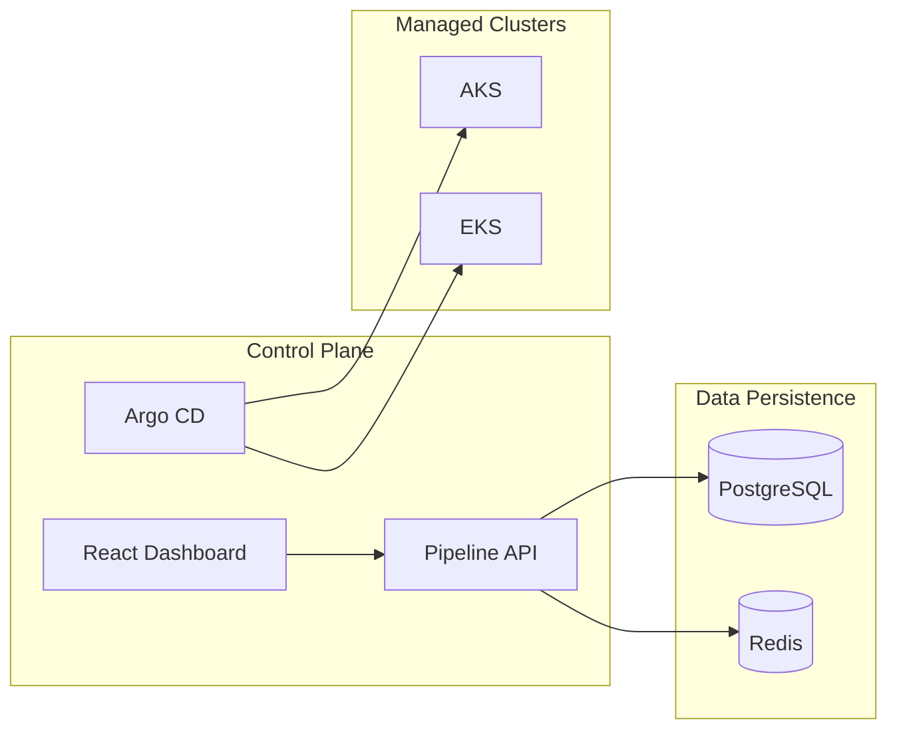

### 3. Frontend to Backend Request Path
Tracing a release promotion request from the portal.

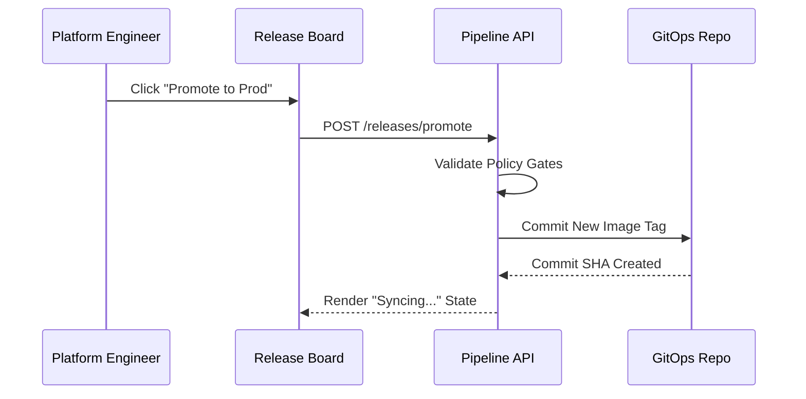

### 4. Multi-Cluster Topology
Managing application delivery across multiple regions and providers.

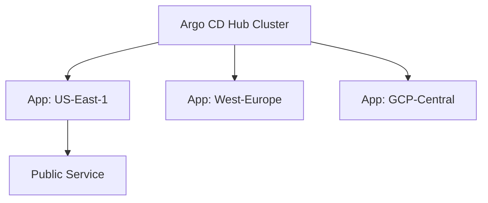

### 5. GitOps Control Plane Architecture
The engine that reconciles Git state with Kubernetes reality.

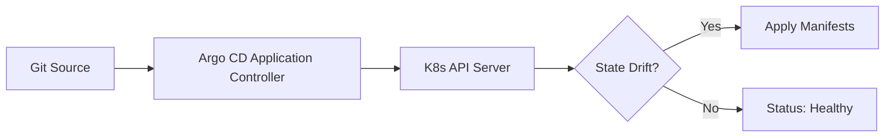

### 6. Regional Deployment Model
Ensuring local performance and global resilience.

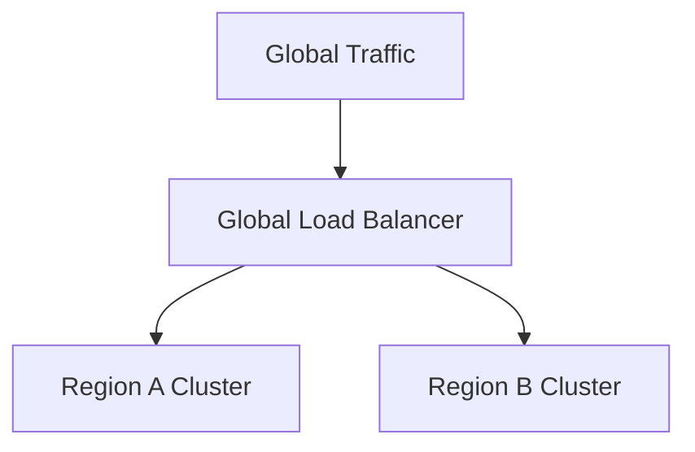

### 7. DR Failover Model
Business continuity for the mission-critical delivery platform.

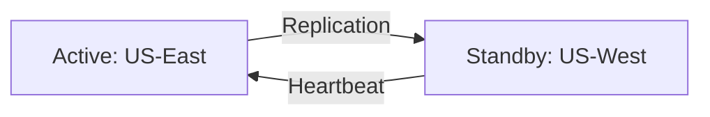

### 8. API Gateway Architecture
Securing the release orchestration interface.

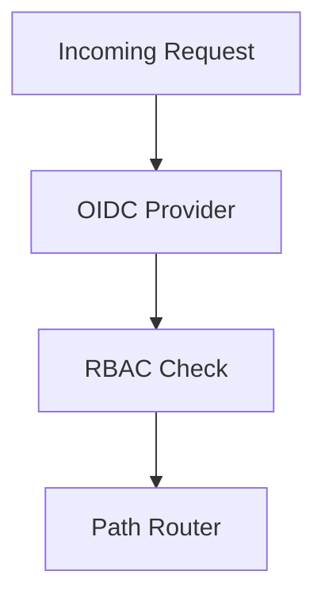

### 9. Queue Worker Architecture
Handling the heavy lifting of pipeline analytics and report generation.

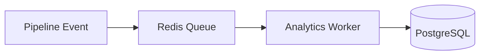

### 10. Dashboard Analytics Flow
How real-time DORA metrics are calculated and displayed.

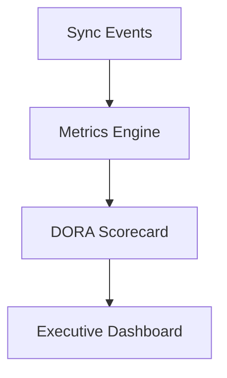

### 11. Developer Commit to Deploy Flow
The complete source-to-production journey.

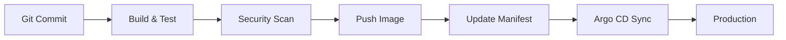

### 12. Pull Request Validation Pipeline
Ensuring quality and security before the merge.

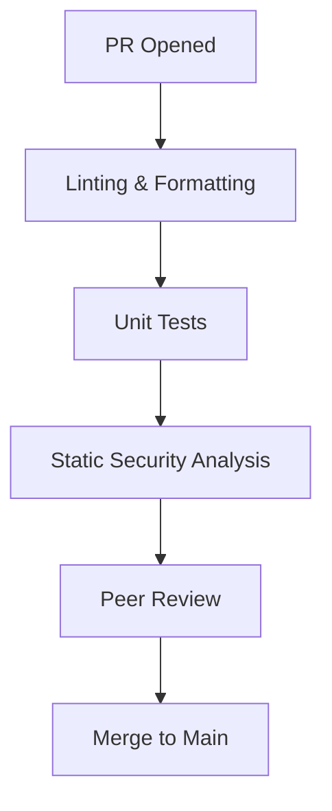

### 13. Container Build Lifecycle
Optimizing for speed and security.

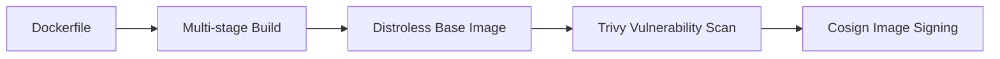

### 14. Registry Promotion Workflow
Promoting images across environments.

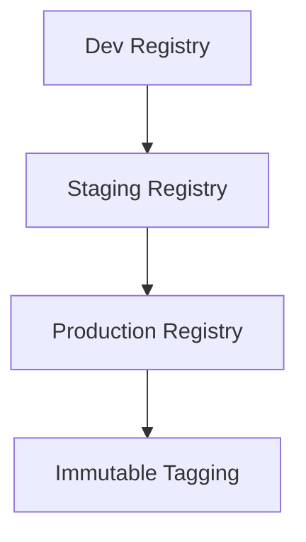

### 15. Terraform Plan/Apply Workflow
Infrastructure as Code delivery.

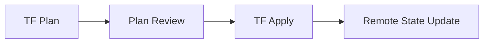

### 16. GitOps Sync Lifecycle
Continuous reconciliation of cluster state.

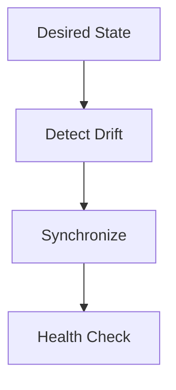

### 17. Argo CD Deployment Flow
Application promotion using Argo.

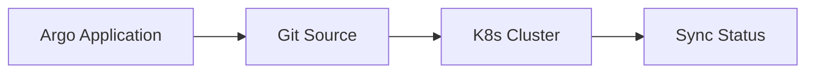

### 18. Blue/Green Deployment Model
Zero-downtime releases with instant rollback.

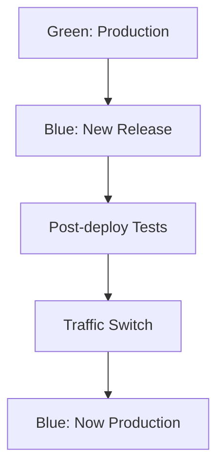

### 19. Canary Release Workflow
Progressive traffic shifting based on health.

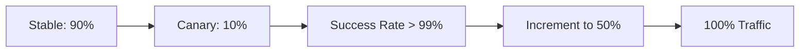

### 20. Rollback Automation Flow
Immediate recovery from failed releases.

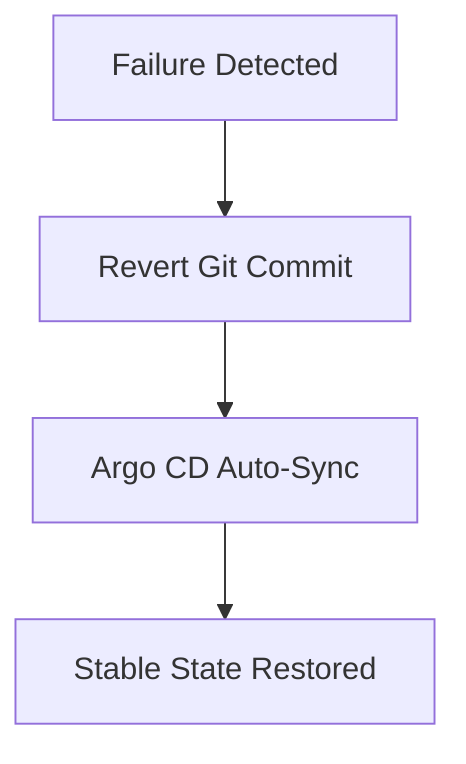

### 21. SAST Workflow
Scanning source code for vulnerabilities.

```mermaid
graph LR
    Code[Source Code] --> Sonar[SonarQube Scan]
    Sonar --> QualityGate[Quality Gate Check]
```

### 22. Dependency Scan Lifecycle
Monitoring the software supply chain.

```mermaid
graph TD
    Deps[Manifests/Lockfiles] --> Snyk[Snyk/OSV Scan]
    Snyk --> Fix[Automated PR Fix]
```

### 23. Container Image Scan Flow
Detecting vulnerabilities in the runtime environment.

```mermaid
graph LR
    Image[Container Image] --> Trivy[Trivy Scan]
    Trivy --> Critical[Block High/Critical]
```

### 24. SBOM Generation Model
Ensuring transparency in the software supply chain.

```mermaid
graph TD
    Build[Build Process] --> Syft[Generate SBOM]
    Syft --> CycloneDX[CycloneDX Format]
```

### 25. Secrets Scan Workflow
Preventing credential leakage.

```mermaid
graph LR
    Commit[Git Commit] --> Gitleaks[Gitleaks Scan]
    Gitleaks --> Block[Reject Commit if Leaked]
```

### 26. Policy Gate Decision Flow
Enforcing governance standards.

```mermaid
graph TD
    Change[Proposed Change] --> OPA[Open Policy Agent]
    OPA -->|Allowed| Deploy[Proceed]
    OPA -->|Denied| Reject[Block & Notify]
```

### 27. Signature Verification Flow
Ensuring image integrity.

```mermaid
graph LR
    Image[Image Pull] --> Kyverno[Kyverno Policy]
    Kyverno --> Verify[Verify Cosign Signature]
```

### 28. Admission Controller Flow
Intercepting K8s API requests.

```mermaid
graph TD
    Req[K8s API Request] --> Mutate[Mutating Webhook]
    Mutate --> Validate[Validating Webhook]
    Validate --> Cluster[Cluster Persistence]
```

### 29. Runtime Security Model
Detecting threats in real-time.

```mermaid
graph LR
    Syscalls[Kernel Syscalls] --> Falco[Falco Monitoring]
    Falco --> Alert[Security Incident Alert]
```

### 30. Compliance Reporting Flow
Visualizing the security posture.

```mermaid
graph TD
    Audit[Audit Logs] --> Report[Compliance Dashboard]
    Report --> CISO[CISO Review]
```

### 31. Metrics Pipeline
Unified observability for delivery.

```mermaid
graph LR
    App[Applications] --> Prom[Prometheus]
    Prom --> Grafana[Grafana Dashboards]
```

### 32. Logging Architecture
Centralized log management.

```mermaid
graph TD
    Pod[Pod Logs] --> FluentBit[Fluent Bit]
    FluentBit --> Loki[Grafana Loki]
```

### 33. Tracing Model
Distributed tracing for microservices.

```mermaid
graph LR
    Req[User Request] --> Tempo[Grafana Tempo]
    Tempo --> Trace[Service Map]
```

### 34. Alert Escalation Workflow
Ensuring rapid response to incidents.

```mermaid
graph TD
    Alert[Firing] --> Manager[Alertmanager]
    Manager --> PagerDuty[PagerDuty/Slack]
```

### 35. SLA Monitoring Flow
Tracking platform availability.

```mermaid
graph LR
    Uptime[Uptime Check] --> SLA[99.9% Target]
```

### 36. Capacity Autoscaling Model
Responding to demand.

```mermaid
graph TD
    CPU[CPU Load] --> HPA[Horizontal Pod Autoscaler]
    HPA --> ClusterAutoscaler[Node Scaling]
```

### 37. Incident Response Workflow
Standardized recovery process.

```mermaid
graph LR
    Detect[Incident] --> Triage[Triage]
    Triage --> Resolve[Fix & Rollback]
    Resolve --> PostMortem[Post-Mortem]
```

### 38. Change Approval Workflow
Auditable human-in-the-loop gates.

```mermaid
graph TD
    PR[Change PR] --> TechLead[Tech Lead Approval]
    TechLead --> SecOps[Security Sign-off]
```

### 39. Release Health Gate Model
Automated promotion based on health.

```mermaid
graph LR
    Metrics[Success Rate] --> Gate[Health Gate]
    Gate --> Promote[Next Environment]
```

### 40. DORA Metrics Ingestion Flow
Automating DORA reporting.

```mermaid
graph TD
    Git[Git Events] + K8s[K8s Events] --> Aggregator[DORA Engine]
    Aggregator --> Dashboard[DORA UI]
```

### 41. Platform Team Operating Model
Defining the relationship between teams.

```mermaid
graph LR
    PlatformTeam[Platform Team] --> Templates[Golden Paths]
    Templates --> AppTeams[App Teams]
```

### 42. Developer Self-Service Workflow
Enabling developers to deploy with autonomy.

```mermaid
graph TD
    Dev[Developer] --> Backstage[IDP/Backstage]
    Backstage --> Scaffolding[Create New Service]
```

### 43. Environment Ownership Matrix
Mapping teams to environments.

```mermaid
graph LR
    Dev[Dev Environment] --> AppTeam[App Team Ownership]
    Prod[Prod Environment] --> PlatformTeam[Shared Governance]
```

### 44. Release Governance Cadence
The rhythm of business for delivery.

```mermaid
graph TD
    Daily[Daily Standup] --> Weekly[Release Review]
    Weekly --> Monthly[Post-Mortem Review]
```

### 45. Enterprise Rollout Roadmap
The journey to elite delivery.

```mermaid
graph LR
    Pilot[Pilot Team] --> Wave1[Business Unit 1]
    Wave1 --> Global[Global Enterprise]
```

---

## 🏗️ DevSecOps & Software Supply Chain

The platform implements the **SLSA (Supply-chain Levels for Software Artifacts)** framework to protect against tampering:
- **Build Integrity**: Builds happen in isolated, ephemeral environments (GitHub Actions).
- **Provenace**: Every container image is accompanied by an attestation of how it was built.
- **Vulnerability Management**: Continuous scanning of images both in the registry and at runtime.

---

## 🚦 Getting Started

### 1. Prerequisites
- **Azure CLI / AWS CLI** installed.
- **Terraform** (v1.5+).
- **Docker Desktop**.
- **Argo CD CLI**.

### 2. Local Setup
```bash
# Clone the repository
git clone https://github.com/Devopstrio/cloud-native-cicd.git
cd cloud-native-cicd

# Setup environment
cp .env.example .env

# Start local services
docker-compose up --build
```
The Release Portal will be available at `http://localhost:3000`.

---

## 🛡️ Governance & Security
- **Identity**: Single-Sign-On (SSO) integrated via OIDC.
- **Least Privilege**: RBAC-managed access to pipelines and environments.
- **Audit**: Every action in the portal and every sync in GitOps is logged for compliance.

---
<sub>&copy; 2026 Devopstrio &mdash; Engineering the Future of Cloud-Native Delivery.</sub>
