<div align="center">


<h1>Cloud-Native CI/CD</h1>

<p><strong>The Institutional-Grade Platform for Standardized Delivery Foundations, Release Governance, and Multi-Cloud CI/CD Ecosystems.</strong></p>

[]()
[]()
[]()

<br/>

> **"Industrializing software delivery to automate release foundations."** 
> **Cloud-Native CI/CD** is an enterprise-grade platform designed to provide a secure, measurable, and highly automated foundation for global delivery operations. It orchestrates the complex lifecycle of software release—from automated GitOps reconciliation and multi-cloud progressive delivery to high-throughput DORA intelligence and unified delivery auditing.

</div>

---

## 🏛️ Executive Summary

Fragmented delivery pipelines and manual release gates are strategic operational liabilities; lack of a standardized cloud-native CI/CD framework is a primary barrier to organizational engineering maturity. Organizations fail to maintain elite delivery performance not because of a lack of tools, but because of fragmented release standards, lack of automated policy gates, and an inability to orchestrate delivery planes with operational precision.

This platform provides the **Delivery Intelligence Plane**. It implements a complete **Cloud-Native-CI/CD-as-Code Framework**, enabling Platform Engineers and CTO organizations to manage global delivery foundations as first-class citizens. By automating the identification of release regressions through real-time telemetry analysis and orchestrating the provisioning of secure performance-driven delivery policies, we ensure that every organizational workload—from core backend services to edge frontend applications—is delivered by default, audited for history, and strictly aligned with institutional delivery frameworks.

---

## 📐 Architecture Storytelling: Principal Reference Models

### 1. Principal Architecture: Global Cloud-Native CI/CD & Delivery Intelligence Plane
This diagram illustrates the end-to-end flow from delivery telemetry ingestion and multi-cloud orchestration to release enforcement, performance validation, and institutional delivery auditing.

```mermaid
graph LR
    %% Subgraph Definitions
    subgraph DeliveryIngress["Source & Pipeline Ingress"]
        direction TB
        Commit_Signals["Git Events / PR Metadata / Build Logs"]
        Security_Gating["SAST / DAST / SBOM Attestations"]
        Manifest_Definitions["K8s Helm / Kustomize / Terraform"]
    end

    subgraph IntelligenceEngine["Delivery Intelligence Hub"]
        direction TB
        API["FastAPI Delivery Gateway"]
        ReleaseOrchestrator["Global GitOps & Sync Hub"]
        Governance_Hub["Compliance & Guardrail Hub"]
        AIOps_Validator["Drift & DORA Analysis Hub"]
    end

    subgraph OperationsPlane["Distributed Delivery Ecosystem"]
        direction TB
        ManagedSyncNodes["Managed Standardized GitOps Controllers"]
        ActiveRunbooks["Managed Automated Progressive Delivery"]
        ArtifactSinks["Managed Infrastructure Delivery Hubs"]
    end

    subgraph OperationsHub["Institutional Data Hub"]
        direction TB
        Scorecard["Delivery Maturity Scorecard"]
        Analytics["Sync Flow & DORA Velocity Stats"]
        Audit["Forensic Delivery Metadata Lake"]
    end

    subgraph DevOps["Cloud-Native-CI/CD-as-Code Framework"]
        direction TB
        TF["Terraform Delivery Modules"]
        DriftBot["Productivity & Config Drift Validator"]
        ChatOps["Measurement Operations Hub"]
    end

    %% Flow Arrows
    DeliveryIngress -->|1. Submit Telemetry| API
    API -->|2. Orchestrate Delivery| ReleaseOrchestrator
    ReleaseOrchestrator -->|3. Apply Privacy Guard| Governance_Hub
    Governance_Hub -->|4. Assess Drift| AIOps_Validator
    
    AIOps_Validator -->|5. Execute Sync| OperationsPlane
    OperationsPlane -->|6. Notify Status| ChatOps
    API -->|7. Visualize Health| Scorecard
    
    Scorecard -->|8. Track Maturity| Analytics
    Scorecard -->|9. Record Performance| Audit
    
    TF -->|10. Provision Backbone| IntelligenceEngine
    DriftBot -->|11. Inject Friction Risk| ReleaseOrchestrator
    Audit -->|12. Improve Operations| ManagedSyncNodes

    %% Styling
    classDef ingress fill:#f5f5f5,stroke:#616161,stroke-width:2px;
    classDef intel fill:#e8eaf6,stroke:#1a237e,stroke-width:2px;
    classDef operations fill:#e1f5fe,stroke:#01579b,stroke-width:2px;
    classDef ops fill:#ede7f6,stroke:#311b92,stroke-width:2px;
    classDef devops fill:#e8f5e9,stroke:#1b5e20,stroke-width:2px;

    class DeliveryIngress ingress;
    class IntelligenceEngine intel;
    class OperationsPlane operations;
    class OperationsHub ops;
    class DevOps devops;
```

### 2. The Delivery Lifecycle Flow
The continuous path of a cloud-native CI/CD platform from initial integration (build) and aggregation (scan) to active analysis (promote), optimization (sync), and institutional forensic auditing (scorecard).

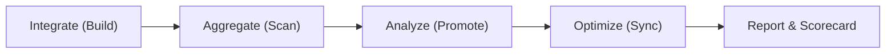

### 3. Distributed Delivery Topology
Strategically orchestrating standardized delivery across global regions, diverse cloud architectures, and multi-cloud targets, providing a unified institutional view of global delivery health and operational readiness.

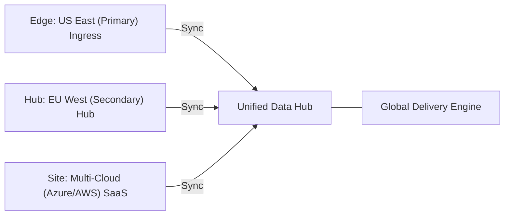

### 4. Delivery Hub & High-Trust Data Plane Protection Flow
Executing complex logic for securing the bridge between release owners and technical teams, ensuring every organizational identity is verified, artifact-level privacy is maintained, and every delivery access is according to institutional standards.

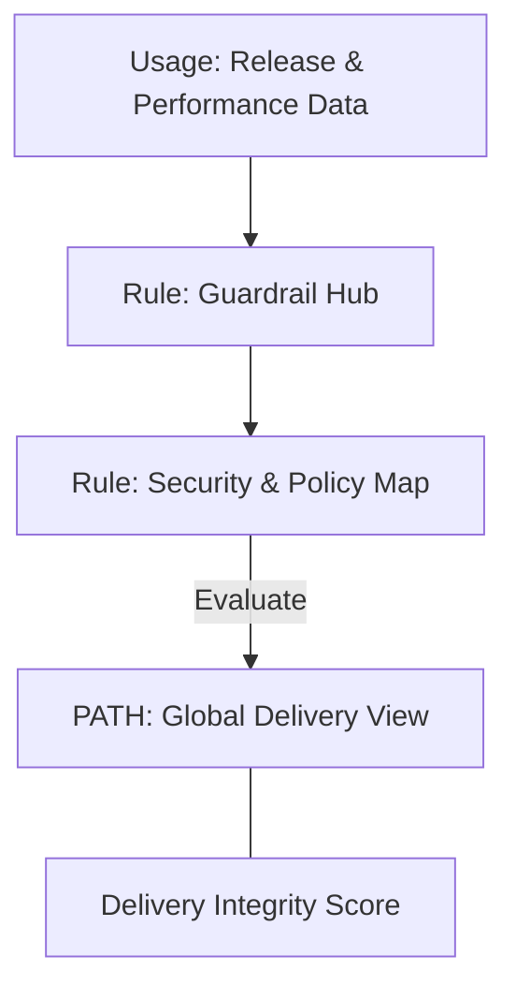

### 5. Multi-Cloud Delivery Federation & Governance Flow
Automatically managing unified delivery standards across global regions and diverse cloud tenants, ensuring institutional data residency and privacy boundaries by default.

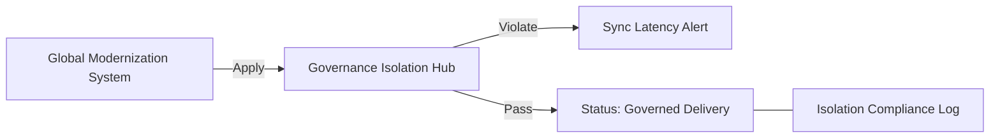

### 6. Encryption & Perimeter Protection Flow (Delivery Standard)
Managing the lifecycle of a delivery request, automatically enforcing institutional TLS 1.3 and resource encryption standards as required by security policy, ensuring zero-latency security confidence.

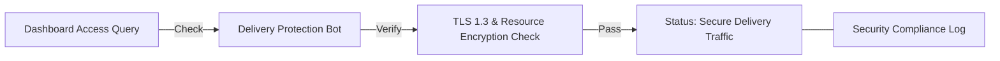

### 7. Institutional Delivery Maturity Scorecard
Grading organizational performance based on key indicators: Deployment Frequency Index, Change Lead Time Index, and Delivery Adoption Scores.

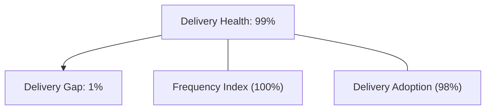

### 8. Identity & RBAC for Delivery Governance
Managing fine-grained access to delivery hubs, provisioning workers, and audit logs between CTOs, Platform Leads, and App Developers.

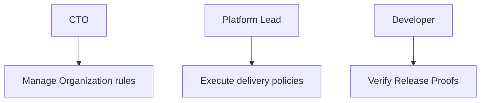

### 9. IaC Deployment: Cloud-Native-CI/CD-as-Code Framework
Using modular Terraform to deploy and manage the versioned distribution of the delivery tracking hubs, sync protection workers, and forensic metadata lakes.

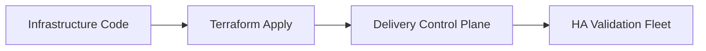

### 10. AIOps Delivery Drift & Risk Validation Flow
Using advanced analytics to identify sudden surges in release failures, unauthorized sync changes, suspicious configuration drifts, or unusual delivery pattern changes that could result in institutional risk or downtime.

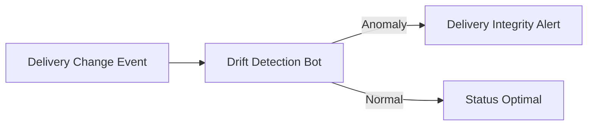

### 11. Metadata Lake for Forensic Delivery Audit
Storing long-term records of every delivery integration event (metadata), every sync executed, and every version history for institutional record-keeping, compliance auditing, and post-provisioning forensics.

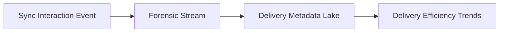

---

## 🏛️ Core Governance Pillars

1.  **Unified Foundation Coordination**: Maximizing resilience by centralizing all delivery measurement through a single institutional plane.
2.  **Automated Sync Provisioning**: Eliminating "manual deployment" scenarios through proactive orchestration and pattern verification.
3.  **Sequential Delivery Intelligence**: Ensuring zero-interruption operations through dependency-aware release-driven data engineering.
4.  **Zero-Trust Identity Protection**: Automatically enforcing identity-based access, data-at-rest encryption, and policy evaluation across all assurance tiers.
5.  **Autonomous Operations Logic**: Guaranteeing reliability through automated industry-specific effectiveness monitoring runbooks.
6.  **Full Delivery Auditability**: Immutable recording of every sync change and delivery provision for institutional forensics.

---

## 🛠️ Technical Stack & Implementation

### Delivery Engine & APIs
*   **Framework**: Python 3.11+ / FastAPI.
*   **Performance Engine**: Custom Python-based logic for multi-cloud GitOps reconciliation and DORA-style delivery metrics.
*   **Integrations**: Native connectors for GitHub Actions, Argo CD, and CNCF toolchains.
*   **Persistence**: PostgreSQL (Delivery Ledger) and Redis (Live Sync State).
*   **Auth Orchestrator**: Federated OIDC/SAML for least-privilege delivery management access.

### Governance Dashboard (UI)
*   **Framework**: React 18 / Vite.
*   **Theme**: Dark, Slate, Indigo (Modern high-fidelity productivity aesthetic).
*   **Visualization**: D3.js for delivery topologies and Recharts for DORA velocity analytics.

### Infrastructure & DevOps
*   **Runtime**: AWS EKS or Azure Kubernetes Service (AKS) for management plane.
*   **Measurement Hub**: Managed event sourcing for immutable productivity timeline reconstruction.
*   **IaC**: Modular Terraform for deploying the delivery landing zone and validation fleet.

---

## 🏗️ IaC Mapping (Module Structure)

| Module | Purpose | Real Services |
| :--- | :--- | :--- |
| **`infrastructure/delivery_hub`** | Central management plane | EKS, PostgreSQL, Redis |
| **`infrastructure/enforcers`** | Distributed sync provisioners | Argo CD, GitHub Runners |
| **`infrastructure/sync_pipes`** | Data Ingestion Hubs | Webhooks, Lambda |
| **`infrastructure/auditing`** | Forensic modernization sinks | S3, Athena, Quicksight |

---

## 🚀 Deployment Guide

### Local Principal Environment
```bash
# Clone the Cloud-Native CI/CD repository
git clone https://github.com/devopstrio/cloud-native-cicd.git
cd cloud-native-cicd

# Configure environment
cp .env.example .env

# Launch the Delivery stack
make init

# Trigger a mock delivery update and automated guardrail validation simulation
make simulate-cicd
```

Access the Management Portal at `http://localhost:3000`.

---

## 📜 License
Distributed under the MIT License. See `LICENSE` for more information.

---
<div align="center">
  <p>© 2026 Devopstrio. All rights reserved.</p>
</div>
